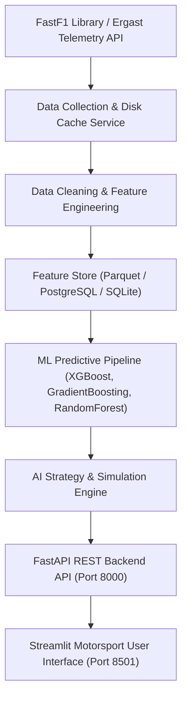

# 🏎️ F1 PITWALL AI — Intelligent Race Strategy & Decision Support Platform


> **F1 PitWall AI** is an end-to-end motorsport data engineering and decision support platform that processes Formula 1 telemetry, trains machine learning models to forecast lap-time degradation, evaluates optimal pit stop windows, and provides interactive "What-If" strategy simulations for race engineers.

---

## 📸 Interface Showcase

| Feature View | Description | Reference Link |
|--------------|-------------|----------------|
| **Race Dashboard** | Driver classification, standings, metric cards, & session summary | [View Specs](docs/screenshots/README.md#1-dashboard-overview) |
| **Race Analytics** | Lap progression, inverted position evolution, sector heatmaps, & team IQR pace | [View Specs](docs/screenshots/README.md#2-advanced-race-analytics) |
| **Tire Strategy** | Compound degradation curves, stint breakdowns, & tire age pace drop-off | [View Specs](docs/screenshots/README.md#3-tire-performance--stint-analysis) |
| **Pit Stops** | Stint compound transitions (Sankey flow) & pit lap histograms | [View Specs](docs/screenshots/README.md#4-pit-stop-strategy--timeline) |
| **Strategy AI** | Real-time pit window predictions & compound recommendations | [View Specs](docs/screenshots/README.md#5-ai-strategy-engine) |
| **What-If Simulator** | Dual strategy scenario comparison (Plan A vs Plan B) | [View Specs](docs/screenshots/README.md#6-what-if-race-strategy-simulator) |
| **Diagnostics** | Real-time API latency inspector & system health monitoring | [View Specs](docs/screenshots/README.md#7-system-diagnostics--telemetry-inspector) |

---

## 🏗️ System Architecture



---

## ⚙️ Key Technical Components

### 1. Data Collection & Caching
- Integrates `FastF1` library to query official F1 timing, sector times, compound telemetry, pit stop history, and weather observations.
- Local disk caching layer (`data/cache/`) prevents unnecessary API calls and enables offline operation.

### 2. Preprocessing & Feature Engineering
- Removes warm-up/cool-down out-laps, safety car laps, and telemetry noise.
- Generates rolling pace metrics (`RollingMeanPace_3`, `RollingMeanPace_5`, `RollingMeanPace_10`).
- Computes stint degradation rates, fuel load linear corrections, and exports cleaned datasets in **Parquet** format.

### 3. Machine Learning Models
- **`LapTimeModel` (XGBoost)**: Predicts baseline expected lap times based on fuel load, compound, tire age, and track temperature.
- **`TireDegradationModel` (GradientBoosting)**: Estimates lap-by-lap pace degradation per compound across extended stints.
- **`PitWindowModel` (RandomForest)**: Predicts optimal pit stop window (laps remaining) with ensemble confidence intervals.
- *Detailed specification available in [Model Documentation Card](docs/models.md).*

### 4. AI Strategy Engine & What-If Simulator
- Hybrid rule-based & ML decision engine considering track temperature, degradation slope, safety car probabilities, and wet weather transitions.
- Scenario comparison simulator projecting total race times and stint deltas between alternative strategies (e.g. 1-Stop Medium-Hard vs 2-Stop Soft-Medium-Hard).

### 5. Production API & Dashboard
- **FastAPI Backend**: Provides 25 OpenAPI REST endpoints, JWT authentication, and structured error handling. *See [REST API Documentation](docs/api.md).*
- **Streamlit Frontend**: Custom dark motorsport UI (`#0d0d0d` background, `#E10600` red accents, responsive Plotly charts, KPI metric cards, and CSV export).

---

## 🚀 Quickstart & Installation

### Option A: Local Development Setup

#### 1. Clone & Set Up Environment
```bash
# Clone the repository
git clone https://github.com/your-username/f1-pitwall-ai.git
cd f1-pitwall-ai

# Create Python virtual environment
python -m venv venv

# Activate environment (Windows PowerShell)
.\venv\Scripts\Activate.ps1

# Activate environment (Linux / macOS)
source venv/bin/activate

# Install dependencies
pip install -r requirements.txt
```

#### 2. Run Backend API Server
```bash
uvicorn backend.main:app --host 0.0.0.0 --port 8000 --reload
```
*Backend interactive docs: [http://127.0.0.1:8000/docs](http://127.0.0.1:8000/docs)*

#### 3. Run Streamlit Frontend Dashboard
In a separate terminal:
```bash
streamlit run frontend/app.py --server.address 0.0.0.0
```
*Frontend UI: [http://localhost:8501](http://localhost:8501)*

---

### Option B: Docker Compose Container Deployment

Deploy PostgreSQL database, FastAPI backend, and Streamlit frontend in containerized environment:

```bash
# Build and launch all services
docker compose up --build
```

Services exposed:
- **Streamlit Dashboard**: `http://localhost:8501`
- **FastAPI REST Service**: `http://localhost:8000`
- **PostgreSQL Database**: `localhost:5432`

---

## 🗄️ Database Migrations (PostgreSQL / Alembic)

Initialize database schema and apply migrations:

```bash
# Run database migrations to latest revision
alembic upgrade head

# Sync historical session telemetry into database
python -c "from backend.services.db_service import sync_session_to_db; sync_session_to_db(2024, 'Bahrain Grand Prix', 'R')"
```

---

## 🤖 Model Training & Verification

Train all machine learning models on session telemetry:

```bash
# Execute ML training script
python scripts/train_models.py
```

Run test suite:

```bash
# Run full pytest suite (33 tests)
pytest -v
```

---

## ⚠️ Known Limitations & Responsible AI Disclosures

> [!NOTE]
> - **Decision Support Scope**: F1 PitWall AI is an open-source educational platform developed for sports analytics research and strategy visualization.
> - **Public Telemetry Reliance**: Models are trained on public telemetry datasets from FastF1/Ergast API. They do not utilize proprietary team secrets, wind tunnel data, or real-time car telemetry.
> - **Safety Car Anomalies**: Laps impacted by Safety Car (SC), Virtual Safety Car (VSC), or Red Flags introduce artificial pace reductions; the preprocessing pipeline filters out these laps to preserve clean training features.
> - **Report Export**: Strategy reports generate formatted HTML documents with native print-to-PDF formatting support.

---

## 🔮 Future Roadmap

- [ ] Real-time WebSocket live timing telemetry ingestion during live sessions.
- [ ] Track surface rubber-in progression forecasting.
- [ ] Driver aggressiveness and overtake difficulty clustering models.

---

## 📜 License

Distributed under the MIT License. See `LICENSE` for details.
